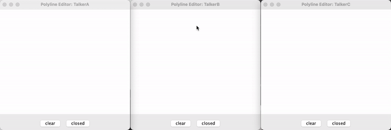

# OnlinePloyLineEditor

### polyline 그림판 + 채팅 -> 그림으로 채팅하자!
한 쪽 토커에서 찍는 그림이 다른 토커들에게도 똑같이 보인다.

점을 찍고 드래그 하면서 그림을 그릴 수 있다.
* clear button : 그림판이 비워진다.
* closed button : 처음 점과 마지막 찍은 점을 이어 닫힌 모양을 만든다.

